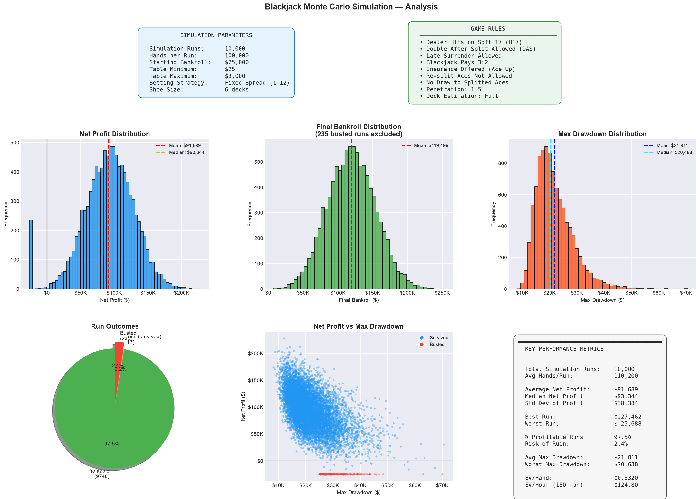

# QuantShoe-Sim: Multithreaded Blackjack Monte Carlo Simulator

A high-performance blackjack simulation engine written in Java. It can run billions of hands across parallel threads to evaluate Hi-Lo card-counting strategies under realistic casino conditions, measuring expected value, max drawdown, and risk of ruin.

## 📁 Project Structure
* `com.quantshoe` — Entry point and simulation orchestrator (`Main`).
* `com.quantshoe.core` — Card, rank, and shoe modeling with Hi-Lo running/true count tracking (`Card`, `Rank`, `Shoe`).
* `com.quantshoe.engine` — Game logic and hand resolution for H17 and S17 rule sets (`GameEngine`, `S17GameEngine`).
* `com.quantshoe.risk` — Bet sizing strategies and count-dependent play deviations (`KellyBettingEngine`, `FixedSpreadBettingEngine`, `DeviationMatrix`).
* `com.quantshoe.pipeline` — Multithreaded worker pool, result aggregation, and CSV export (`SimulationWorker`, `SimulationResult`, `DataExporter`).
* `com.quantshoe.strategy` — Strategy action definitions including deviation-aware actions (`StrategyAction`).

## ⚡ Design Highlights
* **Constant-time strategy lookups:** Playing decisions are pre-compiled into static multidimensional arrays, giving O(1) access for every hand/dealer combination.
* **Count-based playing deviations:** Overrides basic strategy in real time based on the true count, including surrender index plays (e.g., surrender 16 vs 9 above −1, stand 15 vs 10 above +4).
* **Two betting modes:**
  * **Half-Kelly Criterion** — (Experimental) sizes wagers from estimated edge and current bankroll to balance growth against drawdown risk.
  * **Fixed spread (Recommended)** — ramps bets on a 100% configurable unit schedule keyed to the true count.
* **Multi-hand play:** At high true counts the fixed spread engine automatically spreads to two hands to increase hourly EV.
* **Configurable rule sets:** Supports H17/S17 dealer rules, late surrender, resplit aces, and adjustable deck penetration.
* **Thread-parallel simulation:** Uses a fixed-size `ExecutorService` thread pool to distribute simulation runs across all available CPU cores.

## 🚀 How to Run
1. Clone this repository.
```
git clone https://github.com/virajprakash/quantshoe.git
```
2. Make sure you have **Java 17+** installed (`java -version` to check).
3. Compile the source files:
   ```bash
   javac -d out/production/QuantShoe-Sim $(find src -name "*.java")
   ```
4. Run with optional command-line arguments to override defaults:
   ```bash
   java -cp out/production/QuantShoe-Sim com.quantshoe.Main [options]
   ```
   | Flag | Type | Default             | Description |
   |------|------|---------------------|-------------|
   | `--simRuns` | int | 1000                | Number of simulation runs |
   | `--handsPerRun` | int | 100000              | Hands per run |
   | `--startingBankroll` | double | 25000               | Starting bankroll |
   | `--tableMin` | double | 25                  | Table minimum bet |
   | `--tableMax` | double | 3000                | Table maximum bet |
   | `--deckPen` | double | 1.5                 | Deck penetration (decks cut off before reshuffle) |
   | `--gameMode` | string | H17                 | Dealer soft-17 rule (`S17` or `H17`) |
   | `--bettingMode` | string | fixed               | Bet sizing strategy (`kelly` or `fixed`) |
   | `--deckEstimation` | string | full                | Deck estimation granularity (`full`, `half`, or `quarter`) |
   | `--ramp` | string | 1,2x1,6x1,10x1,12x1 | Comma-separated bet ramp in units per TC level starting at `rampStart`. Append `xN` to play N hands at that level (e.g. `1,2x2,6x2,10x2,12x2`). |
   | `--rampStart` | int | 1                   | True count where the ramp begins. TCs below this value bet table minimum with 1 hand. |
   | `--lateSurrender` | boolean | true                | Allow late surrender |
   | `--resplitAces` | boolean | false               | Allow resplitting aces |

   **Example:**
   ```bash
   java com.quantshoe.Main --simRuns 1000 --handsPerRun 100000 --startingBankroll 25000 --tableMin 25 --tableMax 300 --deckPen 1.5 --gameMode H17 --bettingMode fixed --deckEstimation full --ramp 1,2x1,6x1,10x1,12x1 --rampStart 1
   ```
   All flags are optional — omitted flags use their default values.
5. Results print to the console and export to `quant_blackjack_results.csv`.
6. *(Optional)* To generate plots from the CSV output, install Python and the required libraries, then run the visualization script:
   1. Install **Python 3.8+** from [python.org/downloads](https://www.python.org/downloads/). During installation on Windows, **check "Add Python to PATH"**.
   2. Verify the installation:
      ```bash
      python --version
      ```
      On macOS/Linux you may need to use `python3` instead of `python`.
   3. Install the required libraries:
      ```bash
      pip install numpy pandas matplotlib
      ```
      On macOS/Linux you may need to use `pip3` instead of `pip`.
   4. Run the visualization script:
      ```bash
      python visualize_results.py
      ```


## 📊 Sample Output
```text
System Hardware Detected: 8 physical cores available.
Allocating Fixed Thread Pool...
Betting Mode: Fixed Spread ($25-$3000), Ramp: 1,2x1,6x1,10x1,12x1
Game Engine: H17 (Hit on Soft 17)
Deck Estimation: Full deck (rounding to nearest 1.0 deck)
Executing 1000 parallel tests (100000000 cumulative rounds)...
Computation complete! Processing execution time: 6405ms
Processing data export pipelines to: quant_blackjack_results.csv
Data extraction complete! File finalized successfully.

============== SIMULATION SUMMARY ==============
Total Runs              : 1000
Average Net P&L         : $24082.87
Worst-Case Max Drawdown : $55987.50
Risk of Ruin            : 12.00%
=================================================
```

The console also prints an **EV-by-rounds-per-hour table** (hourly and 8-hour session projections) and the **full bet spread** for every true count from −5 to +10.
```
========== EXPECTED VALUE BY ROUNDS PER HOUR ==========
Rounds/Hour          EV/Hour            EV/8hr Session     Hours/Thread       8hr Sessions/Thread
-----------------------------------------------------------------------------------------------
50                   $12.88             $103.00            1870.5             233.8             
60                   $15.45             $123.60            1558.8             194.8             
70                   $18.03             $144.20            1336.1             167.0             
80                   $20.60             $164.80            1169.1             146.1             
100                  $25.75             $206.00            935.3              116.9             
120                  $30.90             $247.20            779.4              97.4              
150                  $38.63             $309.00            623.5              77.9              
200                  $51.50             $412.00            467.6              58.5     
===============================================================================================

=================== BET SPREAD (Starting Bankroll) ===================
True Count         Wager             
--------------------------------------
-5                 $25 x 1           
-4                 $25 x 1           
-3                 $25 x 1           
-2                 $25 x 1           
-1                 $25 x 1           
+0                 $25 x 1           
+1                 $25 x 1           
+2                 $50 x 1           
+3                 $150 x 1          
+4                 $250 x 1          
+5                 $300 x 1          
+6                 $300 x 1          
+7                 $300 x 1          
+8                 $300 x 1          
+9                 $300 x 1          
+10                $300 x 1                        
======================================================================
```